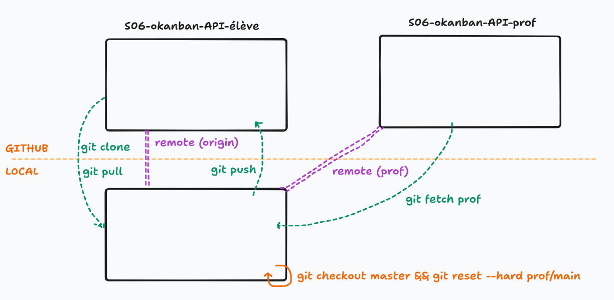

# Gitflow

Idée : 
- Accepter le `ochallenge` le premier jour, puis cloner son propre dépôt généré.
- À partir du deuxième jour, et jusqu'à la fin de la saison, mettre à jour chaque jour son dépôt à partir du code "prof" avant d'entamer l'atelier.

Branche: 
- `master` contiendra le cours et donc la correction du jour
- `jour1`, `jour2`, `jour3`... vos challenges

=> pour chaque challenge vous repartez soit de la correction `master` soit de votre branch  `jourX`...

## 1. Ouvrir votre dépôt

- Ouvrir votre dépôt dans VSCode (pas celui du prof) avec un terminal à disposition.
- Fermer éventuellement les onglets ouverts (ça va switcher chéri !).

## 2. Ajouter le remote du prof

A faire **une seul fois pour la saison**, ajouter le remote `prof` :
- `git remote add prof URL_SSH_DEPOT_PROF` (trouver l'URL (SSH !) du dépôt de VOTRE formateur) en passant par Github ou Kourou)

## 3. Retourner sur `master` et s'assurer que le `git status` est propre

On s'assure d'avoir bien sauvegardé le code de la veille :

- Si vous êtes déjà sur une branche `jour1` :
  - le `git status` doit être "clean", sinon `commit` & `push` comme d'habitude ;
  - puis retourner sur `master` : `git checkout master`.

- Si vous aviez codé directement sur `master` (par inadvertance, bien sûr 😉) :
  - le `git status` doit être "clean", sinon `commit` & `push` comme d'habitude ;
  - sauvegarder votre travail sur une branche à part : `git checkout -b jour1` puis `git push --set-upstream origin jour1` ;
  - puis retourner ensuite sur `master` : `git checkout master`.

## 4. Récupérer les modifications du prof sur `master`

**A faire pour chaque journée**

- S''assurer d'être bien sur la branche `master` :
  - `git checkout master`
- Récupèrer le code du prof en local, sans l'intégrer à la branche courante :
  - `git fetch prof`
- Enfin, on écrase la branche courante (`master`) par la branche `master` du dépôt `prof` :
  - `git reset --hard prof/master` : 

**Pas besoin de pusher la branche Master de votre repo, c'est juste pour avoir la correction**
  
## 4. Créer une nouvelle branche pour la journée 2

Normalement, vous devriez maintenant avoir le code du prof sur votre branche `master` en local !

Il ne reste plus qu'à créer une nouvelle branche pour l'atelier de la journée :

- Soit à partir de la correction : `git checkout -b jour2`
- Soit à partir de votre propre branche : `git checkout jourX` puis `git branch jourX+1`

## 5. Visuellement

## Bonus - Info Final

A la fin du projet, pour que celui-ci soit sur la branche `master`

- dans le repo -> settings -> default branch, changer la branche par default
- supprime la branche locale: `git branch -D master`
- supprime la branche remote: `git push origin -d master`
- re-créer la nouvelle branche master à partir de celle que tu veux : `git checkout -b master`